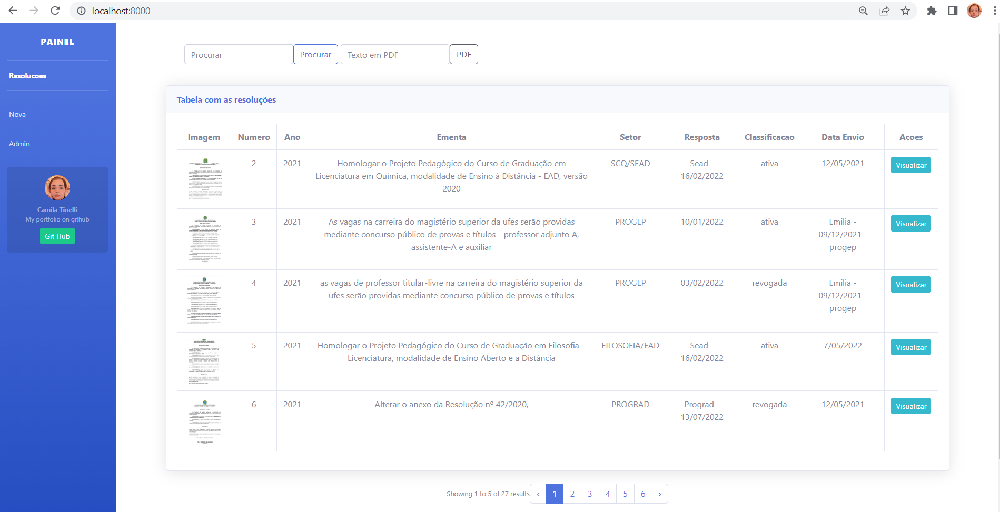

# Atos Normativos - Projeto Piloto

Como requisito final do projeto DevStart PayLivre junto com a Be Academy é desenvolver um sistema com PHP e Laravel 9, surgiu a ideia de aplicar realmente o que foi aprendido durante o curso, logo a demanda proveniente do decreto 10139/19, na qual todos os atos inferiores a legislação precisam ser revistos e necessitam ter uma classificação o seguinte projeto apresenta uma forma mais fácil de gerenciar a demanda.

### Ajustes e melhorias

O projeto ainda está em desenvolvimento e as próximas atualizações serão voltadas nas seguintes tarefas:

- [x] Inclusão do dashboard para administrador
- [x] Inclusão do download das imagens
- [x] Inclusão de cards com quantidades das classificações

## 💻 Pré-requisitos

Antes de começar, verifique se você atendeu aos seguintes requisitos:
* PHP versão mais recente
* Laravel 9

## 🤝 Agradecimentos

Agradeço à Be Academy e a PayLivre pela oportunidade de desenvolvimento do curso.

## 🤝 Colaboradora

<table>
  <tr>
    <td align="center">
      <a href="#">
         
        
          <b>Iuri Silva</b>
        
      </a>
    </td>
    

## 📝 Licença

Esse projeto está sob licença copyleft.

[⬆ Voltar ao topo](#atos-normativos) 
